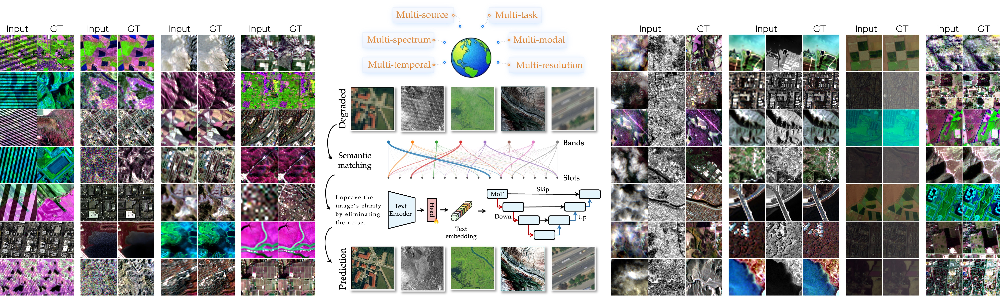

# LLaRS: A Unified Foundation Model for All-in-One Multi-Modal Remote Sensing Image Restoration and Fusion with Language Prompting




## 📦 LLaRS1M data


Below, paths under `data/` are relative to `DATA_ROOT` in [./constants.py](./constants.py). You must manually download all datasets that make up LLaRS.

```text
LLaRS1M/
└── data/
    ├── cloud/
    │   ├── C-CUHK/C-CUHK/CUHK-CR1/train/cloud/303.png
    │   ├── C-CUHK/C-CUHK/CUHK-CR1/train/label/303.png
    │   ├── RICE_DATASET/RICE1/cloud/92.png
    │   ├── RICE_DATASET/RICE1/label/92.png
    │   ├── Haze1k/Haze1k/Haze1k_moderate/train/input/ (224).png
    │   ├── Haze1k/Haze1k/Haze1k_moderate/train/target/ (224).png
    │   ├── SEN12MSCR/ROIs1158_spring_s2_cloudy/s2_cloudy_6/ROIs1158_spring_s2_cloudy_6_p481.tif
    │   └── SEN12MSCR/ROIs1158_spring_s2/s2_6/ROIs1158_spring_s2_6_p481.tif
    ├── sr/
    │   ├── OLI2MSI/train_lr/L8_126038_20190923_S2B_20190923_T49SCR_N0174.TIF
    │   ├── OLI2MSI/train_hr/L8_126038_20190923_S2B_20190923_T49SCR_N0174.TIF
    │   ├── sen2venus/ALSACE/ALSACE/ALSACE_C_32ULU_2019-02-17_10m_b2b3b4b8.pt
    │   └── sen2venus/ALSACE/ALSACE/ALSACE_C_32ULU_2019-02-17_05m_b2b3b4b8.pt
    ├── pansharpening/
    │   ├── NBU_PansharpRSData/1_Satellite_Dataset/Dataset/6_WorldView-3/MS_256/154.mat
    │   ├── NBU_PansharpRSData/1_Satellite_Dataset/Dataset/6_WorldView-3/PAN_1024/154.mat
    │   ├── PanCollection/train_wv3.h5   # sample idx=0 in list JSON
    │   └── PanCollection/train_wv3.h5   # sample idx=1
    ├── stf/
    │   ├── data/CIA/Landsat/L71093084_08420011007_HRF_modtran_surf_ref_agd66.tif
    │   ├── data/CIA/MODIS/MOD09GA_A2001281.sur_refl.tif
    │   ├── data/LGC/Landsat/20040416_TM.tif
    │   └── data/LGC/MODIS/MOD09GA_A2004107.sur_refl.tif
    ├── noise/
    │   ├── SAR-despeckle-Dataset/456.mat
    │   ├── SAR-despeckle-Dataset/417.mat
    │   ├── SAR despeckling filters dataset/Main folder/Noisy/10240_12800.tiff
    │   └── SAR despeckling filters dataset/Main folder/GTruth/10240_12800.tiff
```

**ℹ️ Simulated runs** (e.g. `sim_denoise_*`) do not add a new folder: clean patches are read from real paths such as `pansharpening/.../Gaofen-1/...293.mat` and `cloud/SEN12MSCR/...p481.tif`, then degraded in memory ([utils/sim_ops/__init__.py](utils/sim_ops/__init__.py) `SIM_OP_GROUPS`).

Dataset registry keys and meta paths: [constants.py](constants.py) `DATASET_CONFIGS` and [registries/dataset_registry.py](registries/dataset_registry.py).

### 📂 `data_utils/dataset_files/` layout

Each real dataset normally has a pair: `*_dataset_meta.json` (metadata + pointer to lists) and `*_dataset.json` (train/valid/test sample lists). Simulation uses extra JSON files under `sim/` as sources.

```text
data_utils/dataset_files/
├── cloud/           # cloud / haze / related RGB-style sets
├── cloud_sar/       # SAR-optical cloud removal (SEN12MSCR splits)
├── noise/           # SAR despeckle, SAR filter
├── pansharp/        # NBU .mat + PanCollection .h5
├── sim/             # sim source configs (merge clean patches for SimDatasetBase)
├── sr/              # OLI2MSI, Sen2Venus sites
└── stf/             # spatiotemporal fusion CSV-style keys
```

### `*_dataset_meta.json` (dataset metadata)

Loaded via `DATASET_CONFIGS[...]["meta_file"]`. [data_utils/dataset_base.py](data_utils/dataset_base.py) opens this file first; `path` inside it points at the list JSON.


| Field                                             | Meaning                                                      |
| ------------------------------------------------- | ------------------------------------------------------------ |
| `path`                                            | Path to the sample-list JSON, relative to `PROJECT_ROOT` (e.g. `data_utils/dataset_files/cloud/rice1_dataset.json`). |
| `dataset_name`                                    | Registry / config key (e.g. `cloud_rice1`); must match `DATASET_CONFIGS` and [registries/dataset_registry.py](registries/dataset_registry.py). |
| `dataset_description`                             | Human-readable one-liner.                                    |
| `inputs`                                          | Dict: logical input name → spec for that modality (see table below). Keys (`cloud`, `label`, `lr`, `hr`, `ms`, `pan`, …) must match the keys used in each row of `*_dataset.json`. |
| `num_train`, `num_valid`, `num_test`, `num_total` | Counts (documentation / sanity; loaders use the actual list lengths). |

| Field                       | Meaning                                                                                                               |
| --------------------------- | --------------------------------------------------------------------------------------------------------------------- |
| `description`               | Short label for that input.                                                                                           |
| `width`, `height`           | Nominal spatial size after loading (or patch size).                                                                   |
| `dtype`                     | Storage type hint (e.g. `uint8`, `float32`).                                                                          |
| `num_channels`              | Channel count for that tensor.                                                                                        |
| `visual_channels`           | Which channels to use for RGB-style visualization (indices).                                                          |
| `mean`, `std`, `min`, `max` | Statistics for normalization / display (see `norm_type`).                                                             |
| `norm_type`                 | e.g. `minmax` — used with `norm_shift`, `norm_value` in [utils/image_normalization.py](utils/image_normalization.py). |
| `norm_shift`, `norm_value`  | Parameters for scaling to model input range.                                                                          |


### `*_dataset.json` (sample lists)

Loaded from the file named in meta’s `path`. Required top-level keys: `train`, `test`; optional `valid` ([utils/dataset_utils.py](utils/dataset_utils.py) `load_dataset_splits`).

### `sim/*.json` (simulation source config)

Referenced as `meta_file` for simulated datasets in `DATASET_CONFIGS`. Not a split list itself: it lists which real datasets to draw clean patches from.


| Field         | Meaning                                                      |
| ------------- | ------------------------------------------------------------ |
| `description` | Optional note.                                               |
| `sources`     | List of objects. Each needs `input_key` (which input from that dataset’s meta `inputs`). Use `name` (a key in `DATASET_CONFIGS`; meta path resolved automatically) or `meta_file` (explicit path to a `*_dataset_meta.json`). Optional: `max_samples`, `valid_max_samples` to cap merged lists. |


Merging is implemented in [utils/dataset_utils.py](utils/dataset_utils.py) `build_sim_dataset`.

**⚠️ Note. We are curating a fixed subset of LLaRS1M to simplify acquisition and enable richer experiments. Please follow the journal version of our paper: we will release the full data, code, and model weights with that version.**

---

## 💬 Prompts

- [data_utils/prompts/all_prompts.json](data_utils/prompts/all_prompts.json)
- [utils/prompt_loader.py](utils/prompt_loader.py): train samples a prompt; valid/test use the first string in the list for each task key.

---

## 🚀 Quick start

```bash
cd LLaRS
conda env create -f environment.yml
conda activate llars
python train.py config/test.json
```

---

## 🎯 Training

```bash
python train.py config/your_config.json
```

- `model`: [registries/model_registry.py](registries/model_registry.py) (`llars` in this snapshot) + `kwargs`.
- `train_datasets` / `test_datasets`: entries use `name` from `DATASET_CONFIGS`; optional `max_samples`, `valid_max_samples`, `seed`, etc. ([utils/dataset_builder.py](utils/dataset_builder.py), [data_utils/multi_dataset_datamodule.py](data_utils/multi_dataset_datamodule.py)).
- `trainer`: epochs, batch sizes, `devices`, `strategy`, `resume_ckpt_path`, `only_valid`, `only_test`, … ([train.py](train.py), [utils/training_utils.py](utils/training_utils.py)).
- Optional: `finetune` ([registries/finetune_registry.py](registries/finetune_registry.py)), `algo.routing` ([registries/algo_registry.py](registries/algo_registry.py), e.g. `sinkhorn_v2`).

### ⚙️ Configuration examples

Configs are JSON files passed to `python train.py <path>`.  Dataset keys must exist in [constants.py](constants.py) `DATASET_CONFIGS`.

**1) Simple config**

```json
{
  "model": { "name": "llars", "kwargs": {} },
  "train_datasets": [
    {
      "name": "sim_denoise_gauss_005_iso",
      "max_samples": 16,
      "valid_max_samples": 8,
      "max_vis_samples": 2,
      "valid_max_vis_samples": 2,
      "seed": 42
    }
  ],
  "test_datasets": [],
  "trainer": {
    "max_epochs": 1,
    "precision": "32-true",
    "lr": 0.0002,
    "batch_size": 2,
    "num_workers": 0,
    "devices": [0],
    "strategy": null,
    "check_val_every_n_epoch": 1,
    "save_every_n_epochs": 1,
    "min_save_epoch": 0,
    "resume_ckpt_path": null,
    "only_valid": false,
    "only_test": false,
    "valid_batch_size": 2,
    "test_batch_size": 2
  }
}
```

**2) Sinkhorn router** (`algo.routing`)

Router kwargs are model-specific; align `in_channels` / `num_slots` with the backbone (e.g. `MAX_CHANS` in [constants.py](constants.py)).

```json
{
  "algo": {
    "routing": {
      "name": "sinkhorn_v2",
      "kwargs": {
        "in_channels": 20,
        "num_slots": 20,
        "d_e": 64,
        "proj_dim": 64,
        "num_iters": 8,
        "temperature": 0.2,
        "eps": 1e-8
      }
    }
  }
}
```

**3) Real dataset + held-out test**

Use a key such as `cloud_rice1` for training/validation (still listed under `train_datasets`; validation uses each dataset’s `valid` split from the list JSON). Put evaluation-only sets under `test_datasets`.

```json
{
  "model": { "name": "llars", "kwargs": {} },
  "train_datasets": [
    {
      "name": "cloud_rice1",
      "max_samples": 2048,
      "valid_max_samples": 256,
      "seed": 0
    }
  ],
  "test_datasets": [
    { "name": "cloud_rice1", "max_samples": 10000 }
  ],
  "trainer": {
    "max_epochs": 1,
    "precision": "32-true",
    "lr": 0.0002,
    "batch_size": 4,
    "num_workers": 4,
    "devices": [0],
    "strategy": null,
    "check_val_every_n_epoch": 1,
    "save_every_n_epochs": 10,
    "min_save_epoch": 0,
    "resume_ckpt_path": null,
    "only_valid": false,
    "only_test": false,
    "valid_batch_size": 4,
    "test_batch_size": 1
  }
}
```

**4) Multi-dataset training**

`train_datasets` is a list; samples are concatenated (with optional per-dataset `max_samples` and train-side oversampling when a dataset is shorter than its cap — see [data_utils/multi_dataset_datamodule.py](data_utils/multi_dataset_datamodule.py)).

```json
{
  "train_datasets": [
    { "name": "cloud_rice1", "max_samples": 10000, "valid_max_samples": 100, "seed": 0 },
    { "name": "sr_oli2msi", "max_samples": 5000, "valid_max_samples": 50, "seed": 1 }
  ],
  "test_datasets": []
}
```

**5) Parameter-efficient finetune** (after loading a checkpoint)

When `trainer.resume_ckpt_path` points to a saved run, you can add:

```json
{
  "finetune": {
    "method": "lora",
    "kwargs": {
      "rank": 8,
      "alpha": 16.0,
      "dropout": 0.0,
      "target_modules": ["Conv2d", "Linear"]
    }
  }
}
```

Other `method` values: `dora`, `bitfit`, `ssf`, `adapter`, `full` ([registries/finetune_registry.py](registries/finetune_registry.py)).

**6) Custom sim source merge** (not the training JSON — used as `meta_file` in `DATASET_CONFIGS`)

Example from [data_utils/dataset_files/sim/sim_iso_denoise.json](data_utils/dataset_files/sim/sim_iso_denoise.json); dataset `sim_denoise_gauss_005_iso` points at this file.

```json
{
  "description": "Isolated sources for denoising: pansharp_gaofen1(ms) + cloud_sar_spring(s2)",
  "sources": [
    { "name": "pansharp_gaofen1", "input_key": "ms" },
    { "name": "cloud_sar_sen12mscr_spring", "input_key": "s2" }
  ]
}
```

---

## 📋 Logs

Run folder = `logs/<config_path_without_json>/` (e.g. `config/smoke_llars.json` → `logs/smoke_llars/`).

```text
LLaRS/
├── logs/<run_name>/
│   ├── config.json              # copy of training config
│   ├── ckpt/                    # multi-dataset train; else ckpt/<one_dataset_name>/
│   │   └── epoch=0001.ckpt
│   ├── train_<dataset>.csv      # epoch + loss columns
│   ├── valid_<dataset>.csv      # epoch + psnr/ssim/...
│   ├── test_<dataset>.csv
│   └── <dataset_name>/...       # optional vis from visualize_sample
└── temp/warnings.log
```

---

## 🛠️ Extending the codebase

- **New model**: `forward(batch) -> (pred, loss_dict)` like [pytorch_models/llars/wrapper.py](pytorch_models/llars/wrapper.py); register in [registries/model_registry.py](registries/model_registry.py).
- **New real dataset**: subclass [data_utils/dataset_base.py](data_utils/dataset_base.py); register in [registries/dataset_registry.py](registries/dataset_registry.py); add `DATASET_CONFIGS` + prompts; add meta/list JSON under `data_utils/dataset_files/`.
- **New sim pipeline**: ops + `SIM_OP_GROUPS` in [utils/sim_ops/](utils/sim_ops/); `sim_ops` key in `DATASET_CONFIGS`.
- **New router / finetune / encoder**: [registries/algo_registry.py](registries/algo_registry.py), [registries/finetune_registry.py](registries/finetune_registry.py), [registries/encoder_registry.py](registries/encoder_registry.py).

---

## 📄 License

[MIT LICENSE](LICENSE)

---

## 📖 Citation

```bibtex
@misc{llars,
      title={A Unified Foundation Model for All-in-One Multi-Modal Remote Sensing Image Restoration and Fusion with Language Prompting}, 
      author={Yongchuan Cui and Peng Liu},
      year={2026},
      eprint={2604.05629},
      archivePrefix={arXiv},
      primaryClass={cs.CV},
      url={https://arxiv.org/abs/2604.05629}, 
}
```
